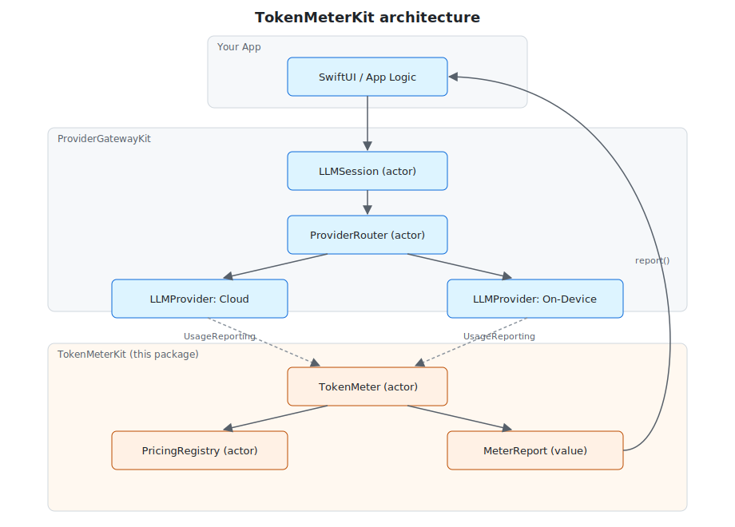
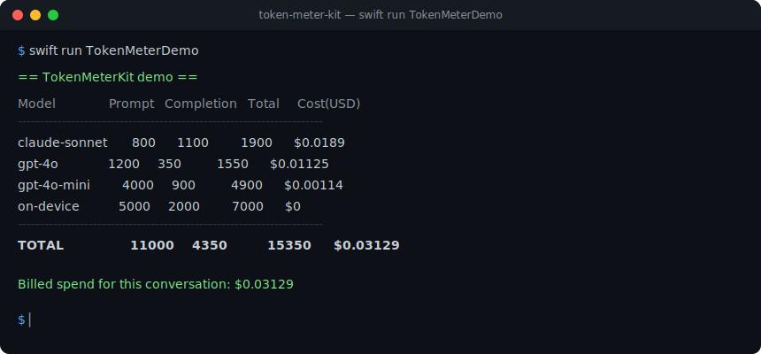
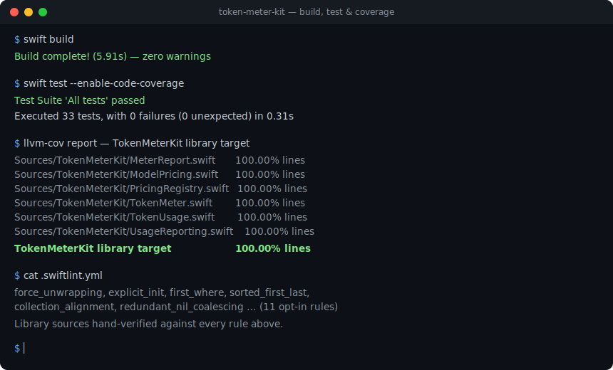

# TokenMeterKit

Actor-based **token-usage and cost metering** for LLM apps in Swift. TokenMeterKit
sits alongside [`ProviderGatewayKit`](https://github.com/rajatslakhina/foundation-model-provider-gateway)
and answers the question every production AI feature eventually asks: *how many
tokens did that conversation burn, and what did it cost — per model, across
failovers?*

It is transport-agnostic and dependency-free. Any provider response — on-device,
cloud, or self-hosted — can be metered by conforming to a single small protocol,
so it drops straight into a gateway-routed pipeline.



## Why it pairs with ProviderGatewayKit

`ProviderGatewayKit` routes a turn across capable providers and fails over when
one trips its circuit breaker. That means a single logical "answer" can touch two
or three models. TokenMeterKit records every hop through the same
`actor`-serialized concurrency model, then prices the aggregate against a
registry you control — giving you an accurate, per-model cost breakdown for the
whole routed exchange.

## Features

- `TokenUsage` — a `Sendable`, `Codable` value type for prompt/completion counts, with `+` accumulation and negative-count clamping.
- `ModelPricing` — `Decimal`-based per-million pricing (no floating-point drift) with a `cost(for:)` calculator.
- `PricingRegistry` — an `actor` catalog of model → pricing, safe to share across concurrent calls.
- `TokenMeter` — the `actor` entry point: record usage, query per-model or total cost, and snapshot a `MeterReport`.
- `UsageReporting` — the one-property protocol that lets any provider response be metered directly.

## Installation

Add the package to your `Package.swift`:

```swift
.package(url: "https://github.com/rajatslakhina/token-meter-kit.git", from: "1.0.0")
```

Then add `"TokenMeterKit"` to your target's dependencies.

## Usage

```swift
import TokenMeterKit

let meter = TokenMeter() // backed by an illustrative default price catalog

// Record usage as each provider hop completes.
await meter.record(TokenUsage(promptTokens: 1_200, completionTokens: 350), for: "gpt-4o")

// Or meter a provider response directly by conforming it to UsageReporting.
struct Response: UsageReporting { let modelID: String; let usage: TokenUsage }
await meter.record(from: Response(modelID: "claude-sonnet",
                                  usage: TokenUsage(promptTokens: 800, completionTokens: 1_100)))

let report = await meter.report()
print(report.formatted())
print("Total: $\(await meter.totalCost())")
```

Register your own live rates rather than relying on the built-in placeholders:

```swift
let registry = PricingRegistry()
await registry.register(ModelPricing(inputPerMillion: 5, outputPerMillion: 15), for: "gpt-4o")
let meter = TokenMeter(registry: registry)
```

## Demo

A runnable command-line demo is included:

```bash
swift run TokenMeterDemo
```

It simulates a gateway-routed conversation that fails over across four models and
prints a metered cost report:



## Quality

- **Build:** `swift build` — clean, zero warnings.
- **Tests:** `swift test` — full XCTest suite.
- **Coverage:** 100% line coverage of the `TokenMeterKit` library target.
- **Lint:** a `.swiftlint.yml` matching the rest of the ecosystem is included; the `swiftlint` binary isn't installable in the sandbox this package was built in (no apt/brew/mint package, and building it from source pulls a prebuilt binary artifact from a GitHub release, which that sandbox's network policy blocks). The library sources were hand-checked line by line against every rule the config enables instead — see the screenshot below for the honest accounting.



## Architecture

TokenMeterKit follows the same protocol-oriented, actor-based design as
ProviderGatewayKit:

- **Value types** (`TokenUsage`, `ModelPricing`, `MeterReport`) are immutable and `Sendable`.
- **Actors** (`PricingRegistry`, `TokenMeter`) serialize all shared mutable state.
- **A protocol** (`UsageReporting`) is the only integration seam, so nothing is coupled to a concrete provider.

## License

MIT © 2026 Rajat S. Lakhina. See [LICENSE](LICENSE).
